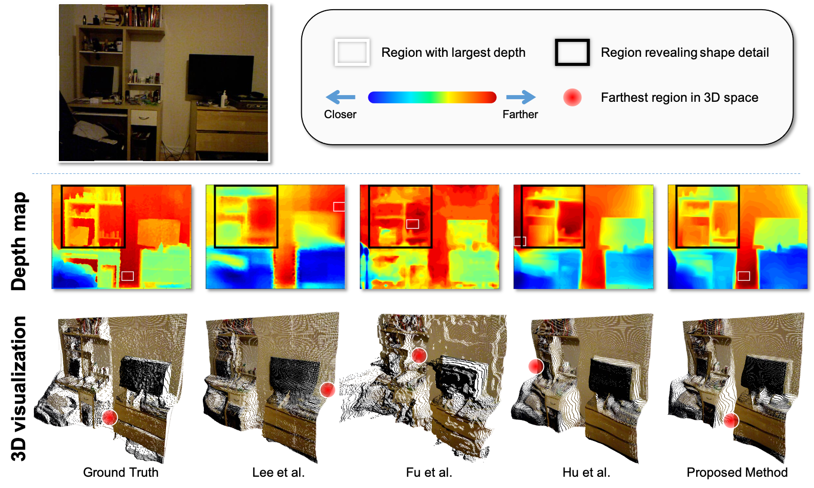
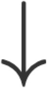
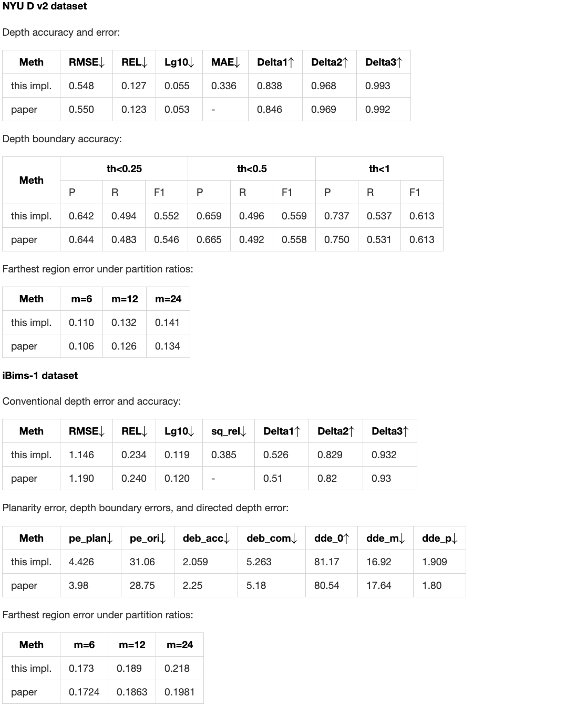

# Boundary-induced and scene-aggregated network for monocular depth prediction

Created by Junfeng Cao, Fei Sheng and Feng Xue.

### Introduction

Monocular depth prediction is an important task in scene understanding. It aims to predict the dense depth of a single RGB image. With the development of deep learning, the performance of this task has made great improvements. However, two issues remain unresolved: (1) The deep feature encodes the wrong farthest region in a scene, which leads to a distorted 3D structure of the predicted depth; (2) The low-level features are insufficient utilized, which makes it even harder to estimate the depth near the edge with sudden depth change. To tackle these two issues, we propose the Boundary-induced and Scene-aggregated network (BS-Net). In this network, the Depth Correlation Encoder (DCE) is first designed to obtain the contextual correlations between the regions in an image, and perceive the farthest region by considering the correlations. Meanwhile, the Bottom-Up Boundary Fusion (BUBF) module is designed to extract accurate boundary that indicates depth change. Finally, the Stripe Refinement module (SRM) is designed to refine the dense depth induced by the boundary cue, which improves the boundary accuracy of the predicted depth. Several experimental results on the NYUD v2 dataset and the iBims-1 dataset illustrate the state-of-the-art performance of the proposed approach. And the SUN-RGBD dataset is employed to evaluate the generalization of our method. [Paper link](https://arxiv.org/abs/2102.13258)




The Data Preparation and Evaluation are following Junjie Hu with [his work](https://github.com/JunjH/Revisiting_Single_Depth_Estimation).
Thanks for his valuable work.

## Dependencies
python 3.6  
Pytorch 1.0  
scipy 1.2.1  
h5py 3.0.0  
Pillow 6.0.0  
scikit-image 0.17.2  
scikit-learn 0.22.1

## Data Preparation

#### NYUD v2

You may download the dataset from [GoogleNetDisk](https://drive.google.com/file/d/1WoOZOBpOWfmwe7bknWS5PMUCLBPFKTOw/view?usp=sharing) or [BaiduNetDisk](https://pan.baidu.com/s/1-p6xH0JUrm6HmUH5eu1Atw) （ShareCode：2e4h）, and unzip it to the ./data folder. You will have the following directory structure:
```
BS-Net
|_ data
|   |_ nyu2_train
|   |_ nyu2_test
|   |_ nyu2_train.csv
|   |_ nyu2_test.csv
```

#### iBims-1

For iBims-1  dataset only have 100 RGB-D pictures especially designed for testing single-image depth estimation methods, you may download the dataset original images from [iBims-1](https://www.bgu.tum.de/lmf/ibims1/) . And you will have the following directory structure:
```
BS-Net
|_ data
|  |_ iBims1
|     |_ ibims1_core_raw
|     |_ ibims1_core_mat
|     |_ imagelist.txt
```
## Training

For training BS-Net on NYUD v2 training dataset, you can run:

```
python train.py
```
You can download our trained model from [Google Drive](https://drive.google.com/file/d/1r-xjxP-Ds5inGKRFHK9JX7VoplcFYiRH/view?usp=sharing) or [Baidu Netdisk](https://pan.baidu.com/s/1WifbKL2_KQ11H1nsYrG3yw) (Code: 1jmz).

Note that: the performance of the given model is slightly different from the manuscript, which is represented as follows.  means smaller is better, and  means larger is better.



## Evaluation

For testing BS-Net on NYUD v2 testing dataset, you can run:
```
python test_NYUDv2.py
```
or testing on iBims-1  dataset you can run:
```
python test_iBims1.py
```


### Citation

If you find BS-Net useful in your research, please consider citing:
```
@article{BSNet,
title = {Boundary-induced and scene-aggregated network for monocular depth prediction},
author = {Feng Xue and Junfeng Cao and Yu Zhou and Fei Sheng and Yankai Wang and Anlong Ming},
journal = {Pattern Recognition},
pages = {107901},
year = {2021}
}
```
